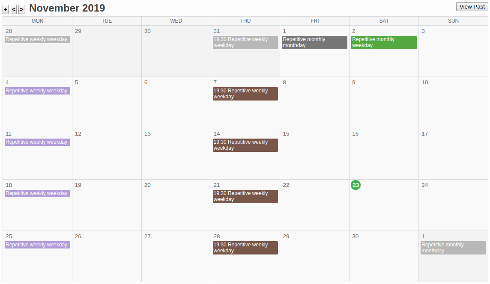
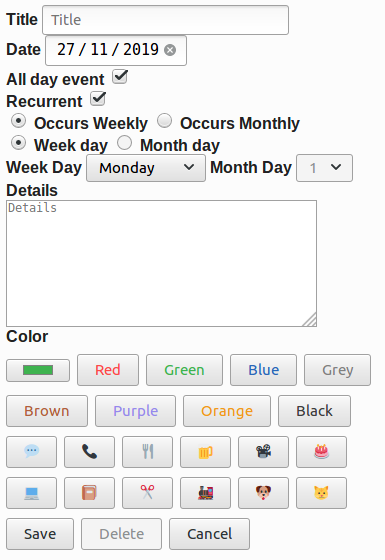

[](https://circleci.com/gh/Kartones/flask-calendar/tree/master)

# flask-calendar

## Introduction
At FED 2024, I made the decision to minimize my use of Google services. The calendar was particularly challenging to replace. There were few alternatives, especially web-based ones. I tried using a Trello board with due dates and labels, but it was difficult to manage. Since it lacked a monthly calendar view and support for recurring tasks, I took some time off to create a basic clone of Google Calendar.


### Details

Main calendar view:



Create new task view:


Please take note of the following features:

- Supports drag and drop functionality on desktop for scheduling days, similar to Google Calendar.
- Allows editing of existing tasks and creating repetitive tasks such as daily, monthly, by weekday, by month day, or on specific day numbers.
- Customizable colors for tasks.
- Offers options for hiding past tasks and manually hiding repetitive task occurrences to maintain a clean view. 

This tool is mobile-friendly, although the action buttons may not be visually appealing, and drag and drop functionality for scheduling days is not available on mobile devices. Additionally, it may not be perfectly designed for all resolutions, but it is functional for most use cases.


## Remarks

This application is compatible with Firefox, Brave, and Chrome. There are no plans to support other browsers, but pull requests are welcome.

We do not use JavaScript libraries or CSS frameworks, so the code and styles may not be very impressive.

We do not use databases because we don't need to perform complex queries. We can achieve what we need with JSON files and basic dictionaries.

Authentication is handled using werkzeug SimpleCache for storage. If the application runs with more than one thread, you may encounter problems. It is recommended to run it with a single process uwsgi or a similar setup.
HTML inputs are favoring HTML5 ones instead of fancy jquery-like plugins to reduce support and increase mobile compatibility.

### Multi-Day tasks

Please take note of the following information:

This feature has a basic implementation and comes with certain limitations:

- It will duplicate the task for each day within the chosen timespan.
- It does not support editing. Once created, each day's task will be treated as a separate, regular task.
- It does not support repetition.


## Requirements

- Python 3.5+ (type hints are compatible with 3.5 upwards)

Other requirements are on the `requirements.txt` file.

## Setup

Please make a note of the following instructions:

The project has been tested with Linux, but it should work without any problems on OSX or Windows as well.

1. Ensure that you have Python (3.5 or newer) installed.
2. Clone or download the repository to your desired location.
3. Run `pip install -r requirements.txt` to install the necessary dependencies.
4. If you prefer not to run it locally, you'll likely need to serve it via a web server. For Flask (the framework that powers this project), the recommended approach is to use `uWSGI`. You can find a comprehensive tutorial [here](URL_1).
5. Optionally, if you already have a web server like `nginx`, it's not difficult to have nginx serve everything. If I remember correctly, I followed [this tutorial](URL_2).
6. Depending on your operating system, user settings, and permissions, you may need to grant write access to the user running your web server for the `DATA_FOLDER`, so it can store any changes.
7. Please refer to the `config.py` file for additional configuration details, and review the ***Miscellaneous*** section below for information on creating users.

### My uWSGI and nginx files

When I hosted an instance of the flask calendar, this were my configuration files, just in case they are of use as a guideline:

`uwsgi.ini`:
```
[uwsgi]

chdir = /path/to/flask-calendar

module = flask_calendar.uwsgi
callable = app
manage-script-name = true
mount = /=%(module):%(callable)

master = true
processes = 1

uid = www-data
gid = www-data
socket = /tmp/flask-calendar.sock
chmod-socket = 660

vacuum = true

logto = /path/to/logs/flask-calendar.log

die-on-term = true
```

nginx's `site-available` file:
```
server {
    listen 80;
    listen [::]:80;

    root /path/to/flask-calendar;
    index index.html;

    server_name your.flask-calendar.hostname;

    location / {
        include uwsgi_params;
        uwsgi_pass unix:/tmp/flask-calendar.sock;
    }

    # other stuff here, like ssl
}
```

## Data Migrations
Starting from version `v1.0`, there is a `\scripts` folder that will contain any required migrations. They will be listed in this section to simplify things.

### Migrations

- `data_migration_001`: **`v0.9` -> `v1.0`**. This migration is not backwards compatible. It must be executed before using `v1.0` logic, as the server will throw errors and may override old `due_time` fields.

## Docker Environment

- Development strongly encourages using Docker and Docker Compose.

### Running

- Edit `config.py` and fill in or adapt to your needs.

```bash
make run
```

Sample username is `a_username` with password `a_password`.

### Locale

Remember to take note of the following text:

The `dev` Dockerfile installs a sample locale (`es_ES`), but does not activate it. Please refer to that file and the `config.py` file for the setup of any locale or for commenting out the lines that install them to speed up the container bootup if you are certain that you do not need them.

You can check which locales you have installed by using the command `locale -a`, and you can add new ones using the following commands:
```bash
cd /usr/share/locales
sudo ./install-language-pack es_ES
sudo dpkg-reconfigure locales
```


### Testing

- Run tests:
```bash
make test
```

- Extract code coverage:
```bash
make coverage
```

### Contributing / Pull Requests
Please make sure you have set up pre-commit (you can [install it](https://pre-commit.com/#installation) and then run `pre-commit install` on the repository) to ensure that flake8 and other linters run before pushing the code.

This project uses [black](https://github.com/psf/black) and [isort](https://github.com/timothycrosley/isort), so it might automatically format and modify your files. Please review the changes and add them to the commit (they should only be related to text formatting and import ordering).

## Virtualenv Environment

1. Create the virtual environment:
```bash
$ python3 -m venv .venv
```

2. Activate it:
```bash
$ source .venv/bin/activate
```

3. Install dependencies (in the virtual environment):
```bash
(.venv) $ pip install -r requirements.txt
(.venv) $ pip install -r requirements-dev.txt
```

4. You are now ready to run the test, extract coverage or run a testing server:
```bash
(.venv) $ # Run tests
(.venv) $ pytest

(.venv) $ # Extract coverage into './cov_html' folder
(.venv) $ pytest --cov-report html:cov_html  --cov=. --cov-config .coveragerc

(.venv) $ # Run testing server
(.venv) $ python -m flask_calendar.app
```

## Miscellaneous

### User creation/deletion

As there is no admin interface, to create or delete users you should create a python file with code similar to the following example:

```python
from authentication import Authentication
import config


authentication = Authentication(data_folder=config.USERS_DATA_FOLDER, password_salt=config.PASSWORD_SALT)

# Create a user
authentication.add_user(
    username="a username",
    plaintext_password="a plain password",
    default_calendar="a default calendar id"
)

# Delete a user
authentication.delete_user(username="a username")
```
